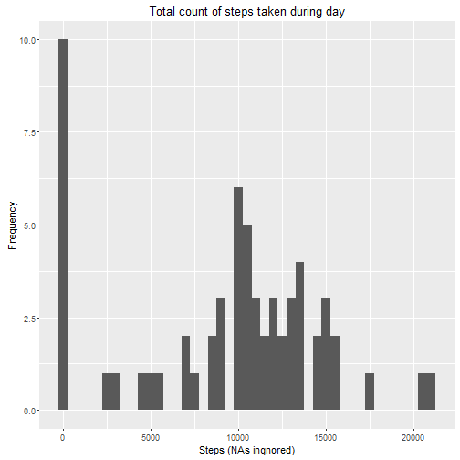
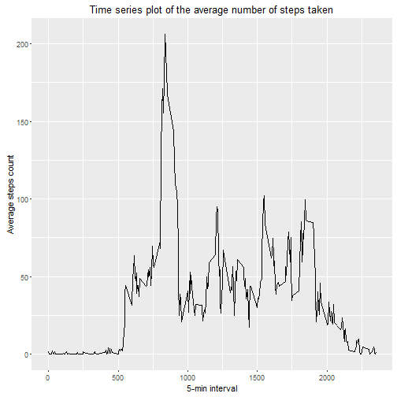
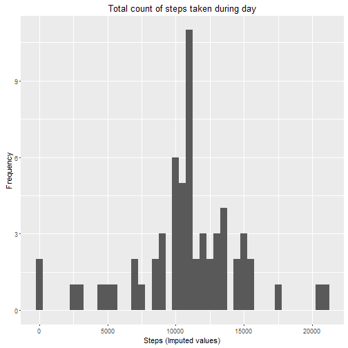
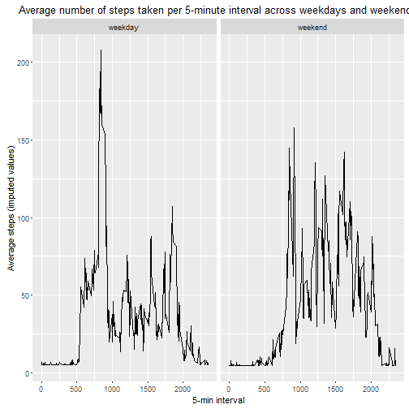

# Coursera Reproducible Research 1st Assignment - Activity Monitoring


-------------------------------------------------------------------

Author: Marija Orlova

08.2016

-------------------------------------------------------------------- 


Loading packages that are used during analysis


```r
library(ggplot2)
library(data.table)
library(Hmisc)
```

--------------------------------------------------------------------------------

### Loading, reading in the dataset and processing the data

Downloading data on 5-min walking test if it isn' in working directory.


```r
if (!file.exists("activity.csv")) {
  url<-"https://d396qusza40orc.cloudfront.net/repdata%2Fdata%2Factivity.zip"
  download.file(url, destfile = "activity.zip")
  unzip("activity.zip")
  file.remove("activity.zip")
}
```

Loading "activity.csv" data in R


```r
a<-read.csv("activity.csv", header=TRUE, sep=",")
```

Changing date variable class to date.


```r
a$date<-as.Date(a$date, "%Y-%m-%d")
```

-------------------------------------------------------------------------------------------------

## Analysis of total count of steps taken during day (ignoring NAs)

--------------------------------------------------------------------------------------------------

Before plotting histogram we need to calculate total steps taken each day.


```r
stepsbydate<-aggregate(x=a["steps"], by=list(date=a$date), FUN="sum", na.rm=TRUE)
```

Now let's plott histogram of total steps count by day.


```r
h<-ggplot(data=stepsbydate,aes(stepsbydate$steps))+geom_histogram(binwidth = 500)+ labs(title="Total count of steps taken during day", x ="Steps (NAs ingnored)", y= "Frequency")
h
```



Now let's find out what mean and median of steps by each day are.


```r
StepMed<-median(stepsbydate$steps, na.rm=TRUE)
StepMean<-mean(stepsbydate$steps, na.rm=TRUE)
```

---------------------------------------------------------------------------------------------------

The mean is 9354.2295082 and the median is 10395.

Difference between average and median is 1040.7704918.

---------------------------------------------------------------------------------------------------

## Analysis of average count of steps for 5-min time periods

-----------------------------------------------------------------------------------------------------

Calculating average steps count over time intervals


```r
stepsbyinterval<-aggregate(x=a["steps"], by=list(interval=a$interval), FUN="mean", na.rm=TRUE)
```

Plotting average stapes taken by interval


```r
g<- ggplot(data=stepsbyinterval, aes(x=interval, y=steps)) + geom_line() + labs(title="Time series plot of the average number of steps taken", x ="5-min interval", y= "Average steps count")
g
```




Let's fing out at which 5-min interval maximum number of steps was made.


```r
maxint<-stepsbyinterval[which.max(stepsbyinterval$steps),"interval"]
```

------------------------------------------------------------------------------------------------------

On average 835 interval contains the maximum number of steps.

------------------------------------------------------------------------------------------------------

## Imputation

------------------------------------------------------------------------------------------------------

Claculating how many rows in original dataset contains NA values.


```r
Narow<-sum(!complete.cases(a))
```

----------------------------------------------

Total number of rows with NAs is 2304.

----------------------------------------------

### Imputing missing data

To impute missing values this script will replace all NAs with average values calculated from dataset.

First of all let's create new data frame.


```r
new<-a
```

And using impute function let's replacing NAs in steps variable with average count of steps.


```r
new$steps<-impute(new$steps, mean)
```

Checking if there are any missing values left in data frame.


```r
na<-sum(!complete.cases(new))
```

---------------------------------------------------

There are 0 cases left with missing values.

----------------------------------------------------

Let's plot histogram of the total number of steps taken each day using data set with imuped missing values and see how it differs from first one histogram, where missing values were ignored. 

First of all, we need to calculate total count of steps taken each day using new imputed data frame as we done it before plotting first histogram.


```r
stepsbydateimp<-aggregate(x=new["steps"], by=list(date=new$date), FUN="sum")
```

Plotting histogram of total steps count each day.


```r
h2<-ggplot(data=stepsbydateimp,aes(stepsbydateimp$steps))+geom_histogram(binwidth = 500)+ labs(title="Total count of steps taken during day", x ="Steps (Imputed values)", y= "Frequency")
h2
```



Now lets calculate mean and median total number of steps using new dataset with imputed values to see how they've changed. 


```r
StepMedimp<-median(stepsbydateimp$steps)
StepMeanimp<-mean(stepsbydateimp$steps)
```

-----------------------------------------------------------------------------------------------

Average steps count ignoring NAs was 9354.2295082, after imputation average is 1.0766189 &times; 10<sup>4</sup>.

Median of steps count ignoring NAs was 10395, after imputation median is 1.0766189 &times; 10<sup>4</sup>.

Difference between mean and median after imputation 0.

------------------------------------------------------------------------------------------------

## Average steps during 5-min time intervals during weekdays and weekends

------------------------------------------------------------------------------------------------

Firstly, let's create a factor variable depending on given date is a weekday or weekend day.


```r
new$day<-as.POSIXlt(new$date)$wday
new$wd<-ifelse(new$day %in% c(0,6), "weekend", "weekday")
new$wd<-as.factor(new$wd)
```

Now let's calculate average count of steps taken per 5-min interval depending on date (weekend or weekday).


```r
bywd<-aggregate(x=new["steps"], by=list(interval=new$interval,wday=new$wd),mean)
```

And finally let's creting panel plot and see difference between activity patterns during weekdays and weekends.


```r
z<-ggplot(bywd, aes(x=interval, y=steps)) + geom_line() +facet_grid(.~wday) +labs(title="Average number of steps taken per 5-minute interval across weekdays and weekends", x ="5-min interval", y= "Average steps (imputed values)")
z
```



